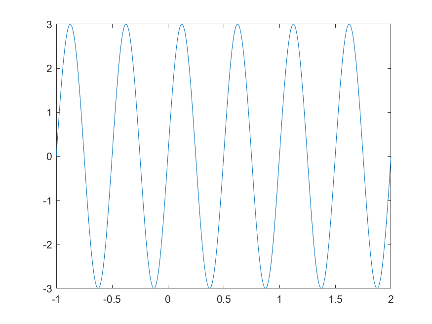

# Sinyal Kontinu dan Sinyal Diskrit

**Perbedaan**

| Sinyal Kontinu | Sinyal Diskrit |
|---|---|
| Memiliki nilai di seluruh waktu | Hanya memiliki nilai di titik-titik sampling |
|  |  |

## Sinyal Kontinu
**Sinyal Kontinu Periodik**

Sinyal periodik adalah sinyal yang memiliki pola berulang pada nilainya dalam panjang waktu tertentu.

Ekspresi umum sinyal sinusoidal kontinu:
$y=A\cdot sin(\omega t + \theta) $

Contoh plot
 Untuk sinyal $y=3\cdot sin(4\pi t)$

## Sinyal Diskrit
**Sinyal Diskrit Periodik**